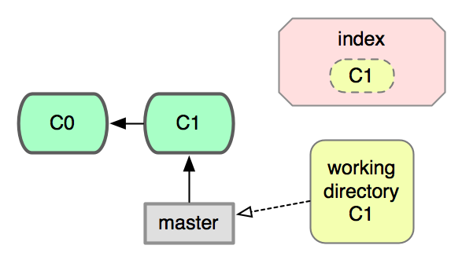
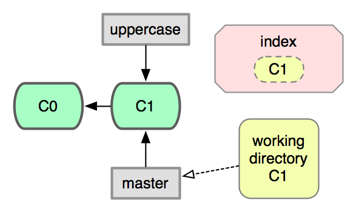
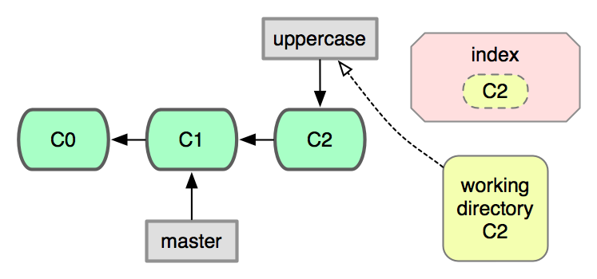
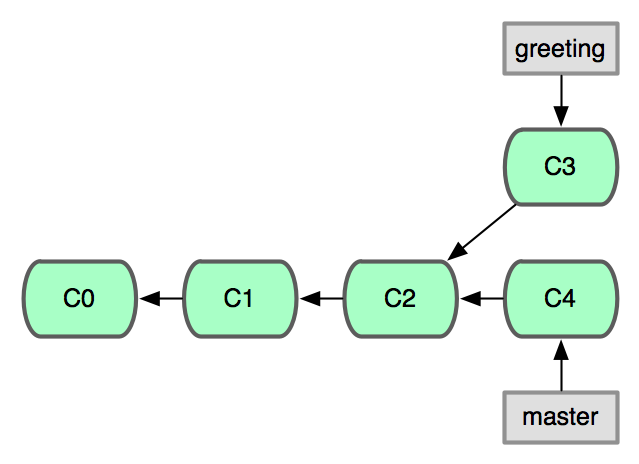
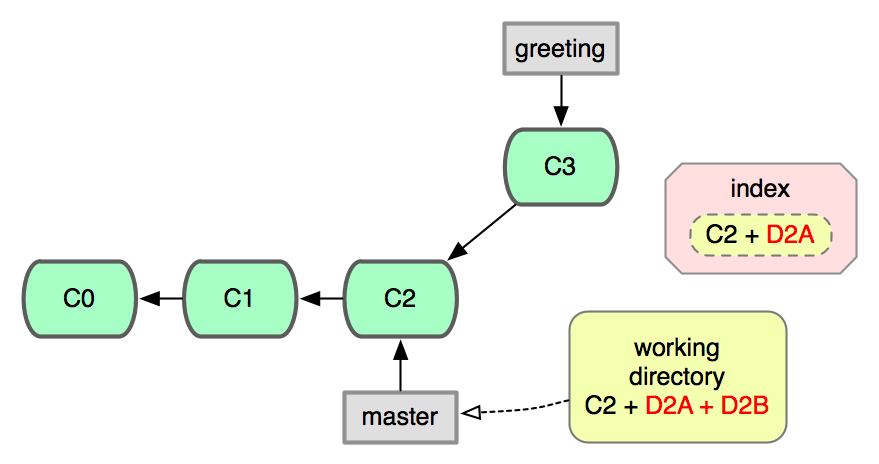

!SLIDE reverse

# Branching and Merging

!SLIDE gitcmd

# git branch

## Show all local branches

                   $ git branch

!SLIDE

# The default branch is named

<h1 style="color: red;">"master"</h1>

!SLIDE center

## Branches are just pointers to commits

!SLIDE center

## It's easiest to think of the working
## directory as corresponding to a branch

!SLIDE center

## As you commit, the branch moves with you

!SLIDE center

## As you commit, the branch moves with you

!SLIDE center

## As you commit, the branch moves with you

!SLIDE gitcmd

# git branch

## Create a new branch pointing at
## the current commit

              $ git branch uppercase

!SLIDE center

## A new branch has been created
## but the working dir has not changed

!SLIDE gitcmd

# git checkout

## Switch working dir to the given branch

             $ git checkout uppercase

!SLIDE center

## Working dir now corresponds to "uppercase"

!SLIDE

## Convert the string to uppercase
## on this branch and commit the change

    $ vim hello.sh
    $ git add -p
    $ git commit -m 'convert string to uppercase'

!SLIDE center

## Branches have now diverged!

!SLIDE

## Switch back to the "master" branch
## Notice that working dir has been changed

<pre>
$ cat hello.sh        # uppercase version
$ git checkout master
$ cat hello.sh        # master version
</pre>

!SLIDE center

## Working directory is now consistent
## with the master branch

!SLIDE gitcmd

# git diff R1 R2

## Diff between two arbitrary commits

            $ git diff master uppercase

!SLIDE center

## Show the work done between branches

!SLIDE gitcmd

# git merge

## Merge the given commit into the current branch

              $ git merge uppercase

!SLIDE

## This kind of merge is known as a

<h2>fast-forward merge because the</h2>

## merged branch was a direct descendent

!SLIDE center

## Both branches now point at the same commit

!SLIDE gitcmd

# git branch -d

## Delete the given branch

             $ git branch -d uppercase

!SLIDE center

## Only the pointer has been deleted

!SLIDE center

## What if both branches have commits?

!SLIDE gitcmd

# git checkout -b

## Create a new branch and switch to it

            $ git checkout -b greeting

!SLIDE

## Modify the greeting, commit,
## and switch back to master

          $ vim hello.sh
          $ git add -p
          $ git commit -m 'new greeting'
          $ git checkout master

!SLIDE

## Create a new file on the master
## branch and attempt to add it

<pre>
  $ vim goodbye.sh
  $ git add -p       # nothing to review!
  $ git status       # find out why
</pre>

!SLIDE

# Tracked Files

## Git remembers what files have been added.
## New files must be explicitly added.

!SLIDE

## Add the contents of the new file

<pre>
    $ git add .   # add everything!
    $ git status  # see that it worked
</pre>

!SLIDE

## Oops, we forgot something...

<pre>
    $ vim goodbye.sh
    $ git status        # make sure
</pre>

!SLIDE center

## Two deltas have been introduced

!SLIDE

## Inspect the deltas, and continue

<pre>
    $ git diff          # newest change
    $ git diff --staged # prior change
    $ git add .         # add again
    $ git commit -m 'added goodbye file'
</pre>